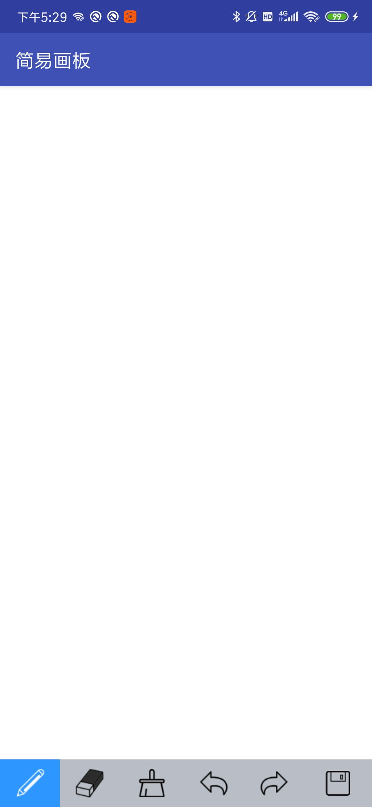
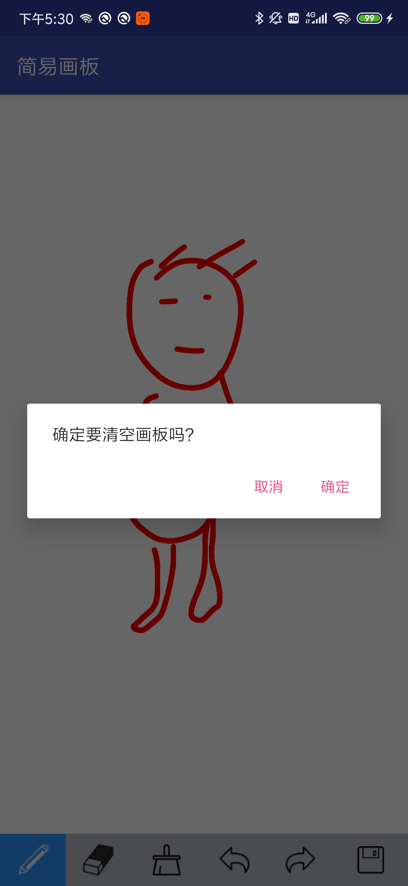
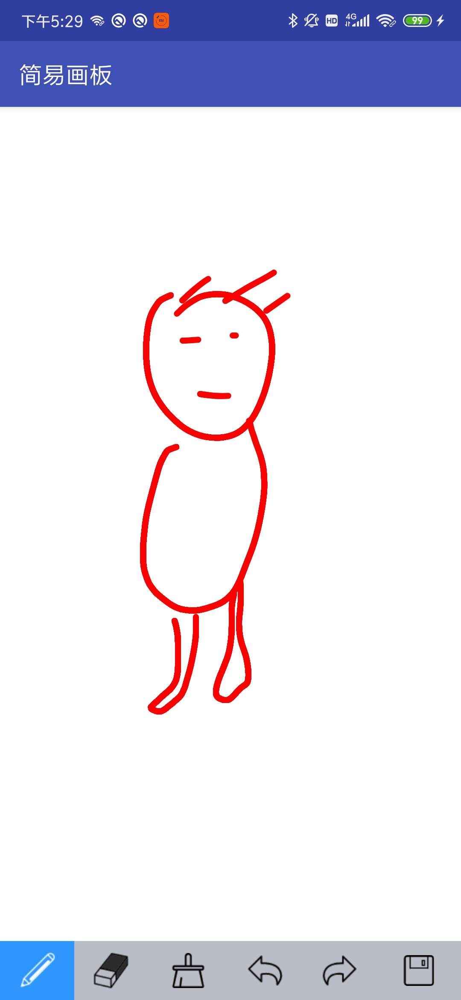

# Painting

### Drawing文件夹中的为django服务端

#### 服务端实现的功能

- 服务端有一个上传图片的API，可以将手机APP上的图片存入服务器进行处理，但是现在还没做完，实现了上传的功能，具体功能的实现需要后续的进行处理。

- 实现APP的后端功能，比如上传、接收、处理、回传等功能，还有数据库登录，社交的数据记载等功能。

后续功能还在扩展中。

### DrawingBoard为安卓实现部分

#### 已经实现的功能

进行画画操作，橡皮擦，全屏清理，撤销上一步，下一步等操作。  
- 绘图，就是进行简单的触摸分析，当用户进行按下操作时进行绘制，当抬起时事件结束。

- 橡皮擦的实现，在用户的触摸范围内进行变色处理即可实现橡皮擦的功能

- 撤销即每次记录用户的路径，如果点击擦除的话则消除前一路径的颜色。

- 前进，同理。

- 文件的保存，使用bitmap来进行画布的文件保存，同时将上传的功能封装到了保存文件的功能中，此处使用了多线程的上传处理来避免长时间的占用主线程造成线程阻塞。

### 后续改进工作还在进行中！